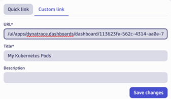

# How to set up Developer Launchpads

## Getting started
Please refer to the Dynatrace documentation for details on features used in examples, such as [Launchpad](https://docs.dynatrace.com/docs/discover-dynatrace/get-started/dynatrace-ui/launchpads), [Segments](https://docs.dynatrace.com/docs/manage/segments), [Dashboards](https://docs.dynatrace.com/docs/analyze-explore-automate/dashboards-and-notebooks/dashboards-new), or [Configuration-as-code](https://docs.dynatrace.com/docs/deliver/configuration-as-code). 

Example segment and launchpad json-templates can be found in the sub folder [/templates](/templates). Some concepts described here are still in preview and might be subject to change.

## License
[Apache License v2.0](https://github.com/dynatrace-oss/dynatrace-monitoring-as-code/blob/main/LICENSE)

## Developer Launchpads
A Developer [Launchpad](https://docs.dynatrace.com/docs/discover-dynatrace/get-started/dynatrace-ui/launchpads) is a customized landing page for development teams, which can be based on standardized templates for scalable rollout. It provides a collection of links, pre-configured for quick access to observability information relevant for developers, tailored to each team's needs, simplifying navigation within the [Dynatrace App ecosystem](https://docs.dynatrace.com/docs/manage/hub). 

Benefits for Developers:
* Streamlined Onboarding: Simplifies onboarding with a clear starting point.
* Consistency: Ensures a uniform approach to observability.
* Enhanced Experience: Boosts Dynatrace adoption by making it user-friendly.
* Increased Efficiency: Saves time navigating Dynatrace.

Benefits for the Central Teams:
* Centralized Control: Standardizes observability across the organization.
* Scalability: Supports scalable rollout with structured start pages.
* Improved Communication: Shares best practices through curated pages.
* Resource Optimization: Reduces repetitive training and support.
* Feedback Loop: Collects user feedback for continuous improvement.

[Click to see an example launchpad on our Playground](https://wkf10640.apps.dynatrace.com/ui/document/v0/#share=33f04d3e-2dca-432a-8626-8e41abdf581a)


## Organization and Structure
A well-structured overview is crucial as it helps developers quickly find the information they need, enhancing productivity and reducing frustration. It ensures that all necessary tools and resources are easily accessible, promoting efficient workflows and better collaboration, as presented in our example Launchpad:

* Dynatrace Key Apps: Frequently used apps like Dashboards, Logs, and Tracing.
* Essentials: Starting points with parameterized links to dashboards and apps.
* Tooling: Links to Git, CI/CD tools, and issue trackers.
* Documentation: Access to docs, training, standards, and templates.
* Collaboration: Links to collaboration tools and support channels.
* Feedback: How to provide feedback and suggest improvements.

## How to set up a Developer Launchpad

### Manage and control Data Access with Segments
[Segments](https://docs.dynatrace.com/docs/manage/segments) provide views of observability data, ensuring users can only access and analyze relevant information while safeguarding sensitive data. Before proceeding, ensure you understand [how to include data in segments](https://docs.dynatrace.com/docs/manage/segments/concepts/segments-concepts-includes) and how to use [filter variables](https://docs.dynatrace.com/docs/manage/segments/concepts/segments-concepts-variables). The following example shows two variants of filter selections in the Distributed Tracing app: On the left a simple segment selector, and on the right a segment filter with an additional variable selection.


### Segment Visibility
The [visibility settings](https://docs.dynatrace.com/docs/manage/segments/concepts/segments-concepts-visibility) of a segment determines who sees the segment it in their list of segments. 

 

Unlisted segments can still be made available to others by being referenced in apps, such as in shared notebooks and dashboards. Everyone has read-only access to all segments. Regardless of configured visibility, any segment can be accessed with storage:filter-segments:read permission. This guarantees that even unlisted segments that may be referenced in a shared notebook, can be used by anyone having access to that notebook.

### Segment Configuration
The Dynatrace documentation details configuring segments for [specific buckets](https://docs.dynatrace.com/docs/manage/segments/use-cases/segments-use-cases-logs-by-bucket) or [Kubernetes clusters](https://docs.dynatrace.com/docs/manage/segments/use-cases/segments-use-cases-kubernetes-clusters) in a common stack. However, these segments might be too broad for developers focused on their specific apps and services. For this use case, the documentation suggests building segments with Kubernetes namespaces by using *k8s.namespace.name* and selecting all related entities (*dt.entity.cloud_application_namespace*).

#### Example: Segment for a K8s service on several development clusters
Here's an example configuration of a data segment for a development team owning the slo-service. This segment filters signals from multiple Kubernetes clusters *dtp-dev-\** for the namespace *slo-service*, including metrics, logs, events, business events, and spans.


Additionally, ***it is required to add all related entitities*** of the Kubernetes namespace: Kubernetes cluster, Kubernetes pod, Kubernetes workload, Service, Process group, Kubernetes service, and container group instance. 


For added related entities, it is not required to include metrics, logs, events, or spans.


#### Example: Configuration of the segment with cluster selection
Variables can be added, in case additional filters are needed in addition to the view the segment provides. The following example adds a variable for selectable clusters to the segment configuration. 
 


By selecting “+ Variable” in the segment configuration, a dialog opens to define selectable values for the cluster with a DQL query, where the fields statement defines the name of the variable “cluster”, to be denoted by $cluster in the Segment definition.
 


## Creating a Launchpad
How to create, share, download and upload a Launchpad is described in the [Dynatrace Launchpad Documentation](https://docs.dynatrace.com/docs/discover-dynatrace/get-started/dynatrace-ui/launchpads). 

### Adding Launchpad Links
Adding links to Dynatrace Apps and Dashboards to Launchpads can be done in two ways:
1.	Quick Links to add available Dynatrace components, like Apps, Dashboards, Notebooks, or Launchpads.
2.	Custom Links to team-specific Dashboards and Apps, by specifying a parametrized URL and a name.
The following example shows a custom link to the ready-made dashboard “Kubernetes Namespace Pods”, using the segment “Segment w/ Variable”, and the cluster variable is set to “dtp-dev5-plsrv”.

``` 
/ui/apps/dynatrace.dashboards/dashboard/113623fe-562c-4314-aa0e-7f73a6d19870#segments=[{"id":"EJdaH8BaOL7","variables":[{"name":"cluster","values":["dtp-dev5-plsrv"]}]}]
```



### Syntax and Examples of Parameterized URLs
The following URLs are functional at the time of writing, but due to the preview nature of several components described in this document, they may be subject to change.
```

# Dashboard with one segment
/ui/apps/dynatrace.dashboards/dashboard/{{.DASHBOARD_ID}}#segments=[{"id":"{{.SEGMENT_ID}}"}]

# Dashboard with preselected segment and cluster variable
/ui/apps/dynatrace.dashboards/dashboard/{{.DASHBOARD_ID}}#segments=[{"id":"{{.SEGMENT_ID}}","variables":[{"name":"cluster","values":["{{.CLUSTER_NAME}}"]}]}]

# Dashboard with preselected segment and default dashboard filters (cluster and namespace)
/ui/apps/dynatrace.dashboards/dashboard/{{.DASHBOARD_ID}}#segments=[{"id":"{{.SEGMENT_ID}}}]&vfilter_Cluster={{.CLUSTER_NAME_DEFAULT}}&vfilter_Namespace={{.NAMESPACE_NAME_DEFAULT}}

# Kubernetes App - Cluster view with preselected segment
/ui/apps/dynatrace.kubernetes/explorer/cluster?segments={{.SEGMENT_ID}} 

# Services App -Services view with preselected segment
/ui/apps/dynatrace.services/explorer/Services?segments={{.SEGMENT_ID}}

# Distributed Tracing App – Explorer view with preselected segment
/ui/apps/dynatrace.distributedtracing/explorer?segments=id%{{.SEGMENT_ID}}
```

## General Access Control and Permissions
It is important to have roles, groups, and access permissions for all included referenced items in place for a seamless Launchpad experience and to reduce support efforts. Make sure that developers know how to get support if they don’t have access or no data is displayed.

* Data in Segments: Please be aware that segments themselves don't contain any data. All queries, with or without segments, always respect data access permissions enforced by IAM policies.
* [Basic access control concepts](https://docs.dynatrace.com/docs/manage/identity-access-management/permission-management/manage-user-permissions-policies/advanced/iam-policystatements): Users must be able to access apps and tools, as well as have visibility into data in referenced Notebooks or Dashboards, and other information they need while maintaining security and control.
* Launchpad and Dashboard access: Make sure to share [dashboards](https://dynatrace-my.sharepoint.com/personal/horst_pichler_dynatrace_com/Documents/___PUBLIC/HowToSetupDevLaunchpad/•%09https:/docs.dynatrace.com/docs/analyze-explore-automate/dashboards-classic/dashboards/share-dashboards) and [launchpads]((https://docs.dynatrace.com/docs/discover-dynatrace/get-started/dynatrace-ui/launchpads#share-launchpads)) with developers in your Dynatrace environment.
* App-specific Permissions: Control access to referenced Dynatrace apps, ensuring that developers can utilize referenced applications they need. This includes setting up rules to allow or deny access based on user roles. You can use [app-specific permissions](https://docs.dynatrace.com/docs/manage/identity-access-management/permission-management/manage-user-permissions-policies/advanced/iam-policystatements) to control who can access and run specific apps.
* Developer Tool Access: This includes access permissions for integrated tools and platforms, such as Git repositories, CI/CD tools, and issue trackers, ensuring that users can seamlessly interact with these resources. 
* Access to referenced Tools and Platforms: This involves permissions for collaboration tools and channels, like Slack or Microsoft Teams, essential documentation and training platforms.
 
## Scaled Rollout
For a scaled roll out of Launchpads for development teams we suggest a configuration-as-code approach:
* Determine different types of developer launchpads with their building blocks, for instance per application or service type
* Configuration and json-export of segment, dashboard and launchpad examples for template extraction
* Templating: Replace ids, filter and other variables with Monaco-style placeholders, like ***{{.TEAM_NAME}}, {{.DASHBOARD_ID}}, {{.SEGMENT_ID}}***, etc.
* Use [Configuration-as-code](https://docs.dynatrace.com/docs/deliver/configuration-as-code) (e.g., with [Monaco]{https://docs.dynatrace.com/docs/deliver/configuration-as-code/monaco}) to realize a scaled rollout of standardized launchpads to dev teams.

Example segment and launchpad json-templates can be found in the sub folder [/templates](/templates).
